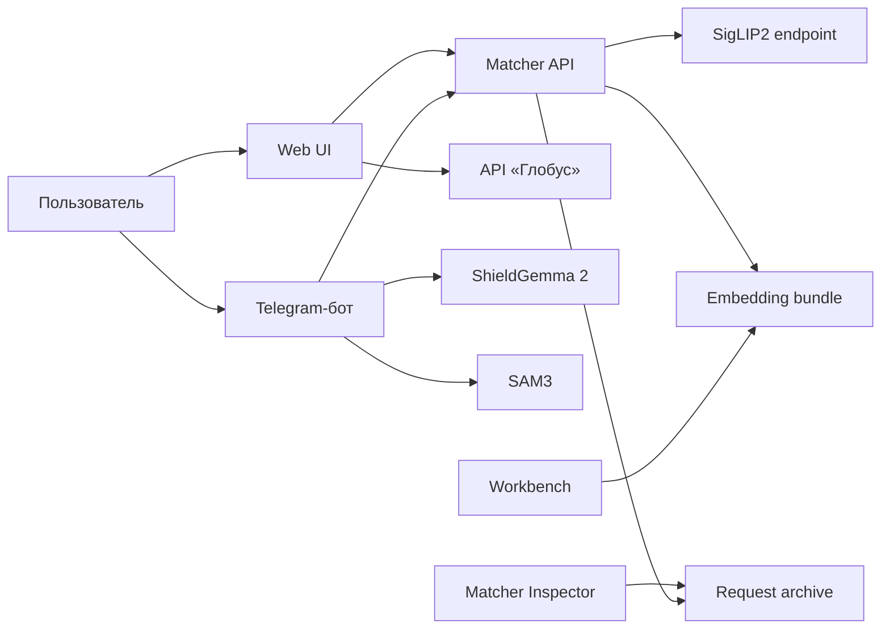

# Архитектура

Система разделяет пользовательские интерфейсы, matcher, model services и лабораторию.

## Компоненты

### Web UI

Nuxt принимает одну фотографию и вызывает свой route `POST /v1/eval/predict`.
Server route работает в `mock` или `upstream` mode. Браузер не видит upstream URL.
Web UI также содержит food recommendations и выключенный по умолчанию shelf mode.

### Telegram-бот

Бот принимает одиночные фотографии и albums. ShieldGemma 2 выполняет moderation.
SAM3 проверяет бутылку и этикетку. Затем бот запрашивает четыре кандидата через
`POST /v1/match?k=4`. Score и margin управляют ответом `Не уверен`.

### Matcher

FastAPI service загружает один pipeline из `matcher/config.yaml`.
Текущий pipeline преобразует фотографию в SigLIP2 vector. Затем он выполняет cosine
search по `full` vectors из embedding bundle.

`POST /v1/eval/predict` возвращает Top-1 slug. `POST /v1/match` возвращает ranked
candidates и карточки вин. Bundle версии 2 содержит vectors и metadata. Bundle не
содержит model weights.

### Model services

`bootstrap/` предоставляет совместимые локальные endpoints для SigLIP2, SAM3,
ShieldGemma 2 и QR scanner. Сервисы читают локальные model snapshots. Они не требуют
доступа к Hugging Face во время работы.

Каждый SAM3 client читает базовый URL из `SAM3_ENDPOINT`.

### Workbench

Workbench хранит SQLite catalogue, test sets, image derivatives, experiment pipelines
и run artifacts. Он строит embedding indexes и экспортирует production bundle для
matcher. Production matcher не импортирует workbench и не читает `lab.sqlite3`.

## Данные и безопасность

- Web UI держит загруженную фотографию в памяти.
- Telegram-бот записывает фотографию только после автоматической модерации.
- В Telegram-боте не прошедшие модерацию картинки хранятся отдельно и не передаются в matcher.
- Matcher MAY сохранять request archive, если настроен `output_dir`.
- API tokens читаются из environment variables.
- Administration UI и Matcher Inspector предназначены только для trusted LAN.

