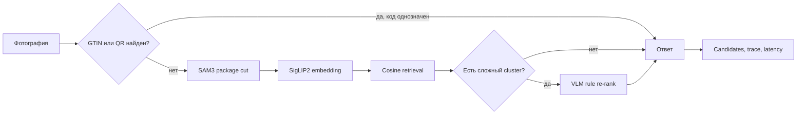

# Архитектура

`svoe-vino-lab` разделяет данные, подготовку изображений, retrieval, re-rank и
измерение результата.

## Поток распознавания

## Компоненты

### Данные

SQLite хранит каталог, изображения, тестовые наборы, GTIN, QR URLs, ручные связи и
комментарии. `pipeline/schema/` хранит последовательные изменения схемы. `db-export/`
хранит текстовый snapshot базы для Git.

Файлы изображений имеют имя по SHA-256. Таблицы хранят ссылки на эти файлы. Такой
подход делает замену файла явной и сохраняет provenance.

### Подготовка изображений

`pipeline/derive.py` готовит `package` и `label` views. Прозрачные изображения получают
crop по alpha channel. Остальные изображения проходят через SAM3. Результат хранится
как производный PNG.

### Retrieval

`pipeline/build_embeddings.py` строит индексы изображений каталога. Backend может быть
локальным или OpenAI-compatible. Активные профили используют варианты SigLIP2.

Pipeline фотографии применяет те же image steps. Затем он ранжирует карточки по cosine
similarity. GTIN или QR может завершить поиск до embedding retrieval.

### Различение похожих карточек

`pipeline/build_clusters.py` группирует близкие карточки. Ручные hard-case links могут
добавить связь между карточками. `pipeline/build_label_rules.py` создаёт правило для
каждого сложного cluster.

Re-rank работает только внутри небольшого окна кандидатов. Он не заменяет retrieval.
Он уточняет порядок карточек с похожим дизайном.

### Измерение

`pipeline/benchmark.py` запускает pipeline на test set. Один run сохраняет параметры,
queries, candidates, metrics, latency и trace. Страница `Runs` показывает эти данные и
позволяет изучить каждую ошибку.

## Границы системы

- Web UI и SQLite работают локально.
- SAM3, embedding models и VLMs могут работать как отдельные services.
- API keys читаются из environment variables.
- Model caches, embedding indexes и run artifacts не входят в Git.
- Локальный server не имеет аутентификации. Он не предназначен для прямой публикации.

## Основные точки входа

| Файл | Назначение |
| --- | --- |
| `pipeline/lab_server.py` | Локальный Web UI и HTTP routes. |
| `pipeline/recognize.py` | Распознавание одной фотографии. |
| `pipeline/build_embeddings.py` | Сборка embedding index. |
| `pipeline/benchmark.py` | Benchmark одного pipeline. |
| `pipeline/run_job.py` | Фоновый benchmark job. |
| `pipeline/labdb.py` | Создание и migration SQLite. |

